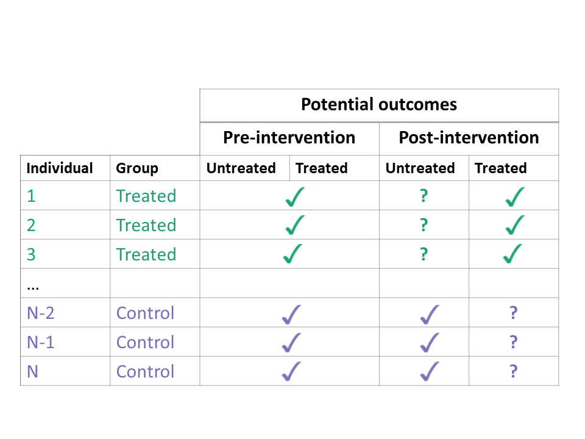
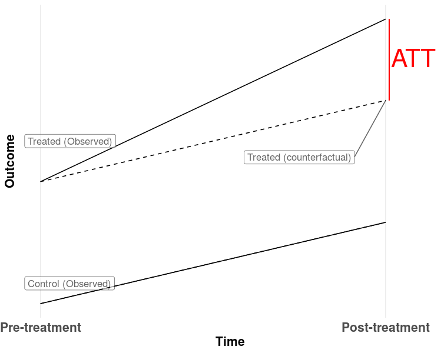
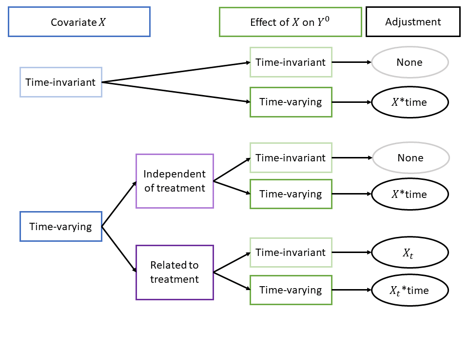

```{r, setup, include=FALSE,echo = FALSE}
knitr::opts_chunk$set(collapse = TRUE, comment = ">", 
                      fig.retina = 3, warning = FALSE, message = FALSE)
library(AER)
library(stargazer)
library(sjPlot)
library(sjmisc)
library(plm)
library(sjlabelled)
library(dplyr)
library(tidyr)
```

# 实验与平均处理效应 (ATE)

在实验中，处理 (treatment) 表示实验对象接受实验操作的作用，也称为接受干预 (intervention)

个体 (individual) $X_i$ 是实验对象，其要么接受处理，要么没有接受处理。
	
- 如果接受处理，则 $X_i = 1$；

- 没有接受处理，则 $X_i = 0$

潜在输出 (potential outcome) 就是某个体接受（或者未接受）某处理之后的输出值 $[Y_i \mid X_i]$。

对于某个体来说，处理的因果效应就是 $Y_i \mid X_i = 1$ 与 $Y_i \mid X_i = 0$ 的差值。


.center[**但是由于 X 要么取1，要么取0，因此个体的因果效应是无法计算的**]


因此我们一般想要（并且能够）计算的是处理对于某个样本的综合效应（平均效应），称作 Average Treatment Effect (ATE)


---
# 随机实验与ATE

理想的随机控制实验 (randomized controlled experiment) 应该满足两个条件

1. 样本个体都是总体中随机抽取的。

2. 样本分配到处理组和控制组的机制也是随机的。

如果两个条件满足，则：

$$\text{ATE} =  E(Y_i\vert X_i=1) -  E(Y_i\vert X_i=0),$$

可以通过简单回归估计该效应：

$$\begin{align}
  Y_i = \beta_0 + \beta_1 X_i + u_i \ \ , \ \ i=1,\dots,n
\end{align}$$

其中，需 $E(u_i\vert X_i) = 0$。

- $\beta_1$ 叫做differences estimator (差分估计)

---
# 控制变量与条件独立性

如果在以上简单差分估计方程中加入额外的控制变量，则有：

$$\begin{align}
  Y_i = \beta_0 + \beta_1 X_i + \beta_2 W_{1i} + \dots + \beta_{1+r} W_{ri} + u_i \ \ , \ \ i=1,\dots,n
\end{align}$$

- Conditional mean (expectation) Independence, 条件均值独立性假设：

$$E(u_i\vert X_i , W_i) = E(u_i\vert W_i) = 0,$$

**条件均值独立性**假设是保证 $\beta_1$ 无偏性的关键假设。

$W_i$ 叫做addtional regressor，或者pre-treatment characteristic。

（有解释力的）额外解释变量（控制变量）的加入可以提升差分估计量的有效性。


---
# 随机试验的有效性及其威胁

.center[内部有效性威胁：]

1. 未充分随机化：个体进入处理组的机制不是完全随机的，说明个体的特征或者偏好影响了它们进入处理组的机制，处理的因果效应不可能得到无偏的估计。

2. 个体未遵守进入处理组的协议 (treatment protocol)

	某些个体不遵守处理协议意味着本来应该进入（通过随机化）的个体通过各种方法拒绝接受处理；或者本来应该进入对照组的个体通过各种方法想要进入处理组 (都称为partial compliance，部分合规)。其本质是影响了随机化原则。

3. 实验损耗 (attrition)

	在实验阶段，本来已经被分配到处理或者对照组的个体系统性的退出了实验。

	所谓系统性指的是退出实验的原因与treatment相关。

4. 实验效应：指的是实验个体知晓他们所在的处理组别，因此可能调整自己的行为。

5. 小样本偏差：样本过小会导致估计的有效性降低从而影响效应估计的准确性。

---
# 实验设计
```{r}
data(STAR)
dim(STAR)
```
模型为：

$$\begin{align}
  Y_i = \beta_0 + \beta_1 SmallClass_i + \beta_2 RegAide_i + u_i
\end{align}$$


```{r}
fmk <- lm(I(readk + mathk) ~ stark, data = STAR)
fm1 <- lm(I(read1 + math1) ~ star1, data = STAR)
fm2 <- lm(I(read2 + math2) ~ star2, data = STAR)
fm3 <- lm(I(read3 + math3) ~ star3, data = STAR)
```

---
```{r echo=F}
tab_model(fmk, fm1, fm2, fm3, emph.p = T, robust = T, show.ci = F, collapse.se = T,string.pred = "Coeffcient", show.se = F, dv.labels = c("K", "1", "2", "3"), p.style = "stars")
```

---
# 加入学生和老师特征控制变量

- experience: 教师教学经验（年）
- boy: 学生的性别
- lunch: 是否可以领取免费午餐
- black: 学生为黑人
- race: 学生的种族
- schoolid: 学校识别代码

```{r}
STARK <- STAR %>% 
      transmute(gender,ethnicity,stark,
                readk, mathk,lunchk,
                experiencek, schoolidk) %>% 
      mutate(black = ifelse(ethnicity == "afam", 1, 0),
                race = ifelse(ethnicity == "afam" | ethnicity == "cauc", 1, 0),
             boy = ifelse(gender == "male", 1, 0))
```

- `transmute()`函数创建新的变量并且只保留新的变量

- `mutate()`创建新变量，但保留已有变量。

---
# 增加控制变量

```{r}
gradeK1 <- lm(I(mathk + readk) ~ stark + experiencek, 
              data = STARK)
gradeK2 <- lm(I(mathk + readk) ~ stark + experiencek + schoolidk, 
              data = STARK)
gradeK3 <- lm(I(mathk + readk) ~ stark + experiencek + boy + lunchk 
              + black + race + schoolidk, 
              data = STARK)
```

增加控制变量，模型分别为：

$$\begin{align}
Y_i =& \beta_0 + \beta_1 SmallClass_i + \beta_2 RegAide_i + u_i,  \\
Y_i =& \beta_0 + \beta_1 SmallClass_i + \beta_2 RegAide_i + \beta_3 experience_i + u_i,  \\
Y_i =& \beta_0 + \beta_1 SmallClass_i + \beta_2 RegAide_i + \beta_3 experience_i + schoolid + u_i, \\
Y_i =& \beta_0 + \beta_1 SmallClass_i + \beta_2 RegAide_i + \beta_3 experience_i + \beta_4 boy + \beta_5 lunch \\ 
& + \beta_6 black + \beta_7 race + schoolid + u_i.
\end{align}$$


---
# 模型对比及主要结论

```{r eval=F}
tab_model(fmk, 
		  gradeK1, 
		  gradeK2, 
		  gradeK3, 
		  emph.p = T, 
		  robust = T, 
		  show.ci = F, 
		  collapse.se = T,
		  string.pred = "Coeffcient", 
		  show.se = F, 
		  dv.labels = c("(1)", "(2)", "(3)", "(4)"), 
		  p.style = "a")
```

- 新控制变量的加入并没有改变主效应参数的符号和大小

- 主效应参数估计的显著性没有改变

- 主效应参数估计的标准误降低，有效性提升

- R方有所提升，控制变量增加了模型解释力。

---
# 准实验 (Quasi Experiments)

- 准实验和随机实验的目的是一样的，都是为了确定某个处理或者干预的因果效应。

- 相比于随机实验，准实验缺乏对处理的完全随机化控制。

- 对于社会科学的诸多领域，完全随机化实验往往是不可能的。准实验是退而求其次的选择，但也发挥着重要的作用。

- 准实验，自然实验 (natural experiments) 与观测研究 (observational study)  往往是同义词。

以下方法都属于准实验方法：

1. Difference in differences：双重差分 (历史悠久，发展依然活跃)
2. Regression discontinuity design: 回归断点设计 (最接近随机实验，较为前沿)
3. propensity score matching: 倾向得分匹配
4. instrumental variables: 工具变量
5. Panel analysis: 面板分析
6. interrupted time series design 等等。。。

这些准实验方法的目的是一样的：**通过各自特别的设计，在一定条件得到满足的情况下，尽可能逼近随机化实验的情景，从而得出有效的因果效应结论。**

参考资料：https://en.wikipedia.org/wiki/Quasi-experiment

---
# 双重差分 (Difference-in-Difference, DID) 方法

Card and Krueger (1994) 最早用DID方法研究最低工资 (minimum wage) 与就业的关系。

- 使用了1992年的截面数据

- New Jersey (treatment) 和 Pennsylvania (control group)。即便两州相邻，但是也不能排除有OVB跟就业有关系。

- 另外也可能有一些州际特征（差异）导致处理组和控制组有显著差异（因此处理就不是随机的）。

- 因此，利用地理位置作为as if random treatment，再用一次差分来识别因果效应的内部有效性是很低的。

- 解决办法：双重差分模型，在地理位置差分的基础上，加上时间差分。选择了两个时间点：1992年2月（treatment实施之前）和1992年11月（实施之后）。

$$\begin{align}
  \widehat{\beta}_1^{\text{diffs-in-diffs}} =& \, (\overline{Y}^{\text{treatment,after}} - \overline{Y}^{\text{treatment,before}}) - (\overline{Y}^{\text{control,after}} - \overline{Y}^{\text{control,before}}) \\
  =& \Delta \overline{Y}^{\text{treatment}} - \Delta \overline{Y}^{\text{control}} \tag{13.8}
\end{align}$$

---
# DID图解
```{r echo=F,fig.align='center', fig.width=9, fig.height=7.5}
plot(c(0, 1), c(6, 8), 
     type = "p",
     ylim = c(5, 12),
     xlim = c(-0.3, 1.3),
     main = "The Differences-in-Differences Estimator",
     xlab = "Period",
     ylab = "Y",
     col = "steelblue",
     pch = 20,
     xaxt = "n",
     yaxt = "n")
axis(1, at = c(0, 1), labels = c("before", "after"))
axis(2, at = c(0, 13))
points(c(0, 1, 1), c(7, 9, 11), 
       col = "darkred",
       pch = 20)
lines(c(0, 1), c(7, 11), col = "darkred")
lines(c(0, 1), c(6, 8), col = "steelblue")
lines(c(0, 1), c(7, 9), col = "darkred", lty = 2)
lines(c(1, 1), c(9, 11), col = "black", lty = 2, lwd = 2)
text(1, 10, expression(hat(beta)[1]^{DID}), cex = 0.8, pos = 4)
text(0, 5.5, "s. mean control", cex = 0.8 , pos = 4)
text(0, 6.8, "s. mean treatment", cex = 0.8 , pos = 4)
text(1, 7.9, "s. mean control", cex = 0.8 , pos = 4)
text(1, 11.1, "s. mean treatment", cex = 0.8 , pos = 4)
```

---
# DID  相关术语

- $Y(t)$：$t$ 时间点的观测结果

- $A = 0$: 对照组 (未接受处理，或者未接受干预)

- $A = 1$: 处理组 (接受处理，或者接受干预)

- $t=1, \ldots, T_0$: 干预前时间点 (pre-treatment times)

- $t=T_0 +1, \ldots, T$: 干预后时间点 (post-treatment times)

- $Y^a(t)$: 时间 $t$ 处理 $A=a$ 的潜在结果 (potential outcome)

- $X$: 可观测协变量; $U$: 未观测协变量

DID关心的不是ATE，而是处理组的平均处理效应 (Average effect of treatment on the treated, ATT)

$$\begin{equation*}
ATT \equiv \mathbb{E}\left[Y^1(2) - Y^0(2) \mid A = 1\right]
\end{equation*}$$

- 事实 (factual): $Y^1(2)\mid A = 1$
- 反事实 (counterfactual): $Y^0(2)\mid A = 1$

---

```{r echo = F, fig.align='center', out.width = "750px"}

```
.footnote[来源：https://diff.healthpolicydatascience.org/]


---
# DID主要假定

处理组的反事实结果是不存在（缺失，不可观测）的，因此使用对照组在干预时间点后的结果来impute处理组的反事实结果。

DID需要满足一些较强的假设才能得到准确一致的估计结果：

- 一致性假设：反事实结果是不可观测的，并且干预措施对干预前Y没有影响:
$$Y(t) = (1 - A) \cdot Y^0(t) + A \cdot Y^1(t) \\
Y(t) = Y^0(t) = Y^1(t),\; \mbox{for}\ t \leq T_0
$$

- 平行趋势假设 (反事实假设) 是DID最重要的假设，表示为:
$$\begin{align}
\mathbb{E}\left[Y^0(2) - Y^0(1) \mid A = 1\right] = \\
\nonumber \mathbb{E}\left[Y^0(2) - Y^0(1) \mid A = 0\right]
\end{align}$$.

- 处理组如果没有获得处理的前后增量（反事实增量）与对照组没有获得处理的前后增量（事实增量）相等。
- 这个假设是无法检验的，因为其中反事实部分 $Y^0(2) \mid A = 1$ 是不可观测的。

- 概率性 (positivity) 假设, 单个X的取值无法确定个体是否接受处理, $0 < P(A = 1 | X) < 1 \; \text{ for all } X$。

---
# ATT识别

ATT的理论估计需要反事实结果，但在以上假设满足的情况下，可以使用事实结果进行估计。这个过程叫做识别(identification)

可以证明:
$$\begin{align*}
ATT &\equiv \mathbb{E}\left[Y^1(2) - Y^0(2) \mid A = 1\right] \ \ \ \ \scriptsize{\text{(Definition of the ATT)}}\\
&= \mathbb{E}\left[Y^1(2) \mid A = 1\right] - \mathbb{E}\left[Y^0(2) \mid A = 1\right] \ \ \ \ \scriptsize{\text{(Linearity of expectation)}}\\
&= \mathbb{E}\left[Y^1(2) \mid A = 1\right] - \left(\mathbb{E}\left[Y^0(2) - Y^0(1) \mid A = 0\right] + \mathbb{E}\left[Y^0(1) \mid A = 1\right]\right) \ \ \ \ \scriptsize{\text{(By counterfactual assumption)}}\\
&= \left(\mathbb{E}\left[Y^1(2) \mid A = 1\right] - \mathbb{E}\left[Y^0(1) \mid A = 1\right] \right) -\left(\mathbb{E}\left[Y^0(2) \mid A = 0\right] - \mathbb{E}\left[Y^0(1) \mid A = 0\right]\right) \ \ \ \ \scriptsize{\text{(Reorganizing terms)}}\\
&= \lbrace \mathbb{E}\left[Y(2) \mid A = 1\right] - 
   \mathbb{E}\left[Y(1) \mid A = 1\right] \rbrace - \\
&\;\;\;\; \lbrace \mathbb{E}\left[Y(2) \mid A = 0\right] -
   \mathbb{E}\left[Y(1) \mid A = 0\right] \rbrace \; \ \ \ \ \scriptsize{\text{(By consistency assumption)}}.\\
\end{align*}$$

因此在上述假设成立时，ATT可以用DID来估计：

$$\begin{align*}
ATT &\equiv \mathbb{E}\left[Y^1(2) - Y^0(2) \mid A = 1\right] \\
&= \lbrace \mathbb{E}\left[Y(2) \mid A = 1\right] - 
   \mathbb{E}\left[Y(1) \mid A = 1\right] \rbrace - \\
   & \ \ \ \ \ \ \lbrace \mathbb{E}\left[Y(2) \mid A = 0\right] -
   \mathbb{E}\left[Y(1) \mid A = 0\right] \rbrace
\end{align*}$$

---
```{r echo = F, fig.align='center', out.width = "700px"}

```
.footnote[来源：https://diff.healthpolicydatascience.org/]


---
# DID估计量

双重差分涉及到四个量：

1. $\mathbb{E}\left[Y(2) \mid A = 1\right]$

2. $\mathbb{E}\left[Y(1) \mid A = 1\right]$

3. $\mathbb{E}\left[Y(2) \mid A = 0\right]$

4. $\mathbb{E}\left[Y(1) \mid A = 0\right]$

- 这四个量都是可以观测到的，可以使用DID回归模型直接获得ATT估计值。

- 也可以分别计算四个期望值并通过二次差值得到ATT估计值。

- DID回归模型的使用更加普遍。

---
# DID回归模型
	
$$\begin{align}
Y_i =& \beta_0 + \beta_1 D_i + \beta_2 Period_i + \beta_{TE} (Period_i \times D_i) + \varepsilon_i \tag{13.11}
\end{align}$$
	
模拟验证DID模型

.pull-left[
```{r}
# 样本量
n <- 200
# 处理效应
TEffect <- 4
# 处理变量
TDummy <- c(rep(0, n/2), rep(1, n/2))
# 模拟Y数据
y_pre <- 7 + rnorm(n)
y_pre[1:n/2] <- y_pre[1:n/2] - 1
y_post <- 7 + 2 + TEffect * TDummy + rnorm(n)
y_post[1:n/2] <- y_post[1:n/2] - 1 
```

```{r}
mean(y_post[TDummy == 1]) - mean(y_pre[TDummy == 1]) - 
	(mean(y_post[TDummy == 0]) - mean(y_pre[TDummy == 0]))
```

]
.pull-right[
```{r echo=F,fig.height=6}
library(scales)
pre <- rep(0, length(y_pre[TDummy==0]))
post <- rep(1, length(y_pre[TDummy==0]))
plot(jitter(pre, 0.6), 
	 y_pre[TDummy == 0], 
	 ylim = c(0, 16), 
	 col = alpha("steelblue", 0.3),
	 pch = 20, 
	 xlim = c(-0.5, 1.5),
	 ylab = "Y",
	 xlab = "Period",
	 xaxt = "n",
	 main = "Artificial Data for DID Estimation")
axis(1, at = c(0, 1), labels = c("before", "after"))
points(jitter(pre, 0.6), 
	   y_pre[TDummy == 1], 
	   col = alpha("darkred", 0.3), 
	   pch = 20)
points(jitter(post, 0.6),
	   y_post[TDummy == 0], 
	   col = alpha("steelblue", 0.5),
	   pch = 20)
points(jitter(post, 0.6), 
	   y_post[TDummy == 1], 
	   col = alpha("darkred", 0.5),
	   pch = 20)
```

]

---
	
- 可以在时间上差分之后再回归

```{r}
lm(I(y_post - y_pre) ~ TDummy)
```


- 也可以构造交叉项,一次回归得到DID结果：
```{r}
d <- data.frame("Y" = c(y_pre,y_post),
				"Treatment" = TDummy, 
				"Period" = c(rep("1", n), rep("2", n)))
lm(Y ~ Treatment * Period, data = d)
```

---
# Card and Krueger (1994)实例
	
```{r}
cardkrueger <- read.csv("data/cardkrueger1994.csv")
ck_did <- lm(fte~treated+t+I(treated*t), data = cardkrueger)

# 或者使用formula同时得到主效应和交叉效应
# ck_did <- lm(fte~treated*t, data = cardkrueger)

coeftest(ck_did)
```

---
# 多个时间点的DID问题

上述DID是最为简化的DID模型，在干预前后各有一个时间点。这是理想化的情形，真实的实证数据大多数具有**多时间点(multiple time periods)**：

.center[也就是处理组和对照组在干预时间点前后都具有多个时间序列观测数据。]

此时，我们估计的ATT将发生时变：

1. 干预时间点 $T_0$ 后的任意时间点 $t$，都可以计算一个ATT，因此得到时变(time-varying) ATT:
$$\begin{equation*}
ATT(t) \equiv \mathbb{E}\left[Y^1(t) - Y^0(t) \mid A = 1\right]
\end{equation*}$$

2. 也可以在整个干预后时间段计算平均ATT
$$\begin{equation*}
ATT \equiv \mathbb{E}\left[\overline{Y^1}_{\{t>T_0\}} - \overline{Y^0}_{\{t>T_0\}} \mid A = 1\right]
\end{equation*}$$

- 上述ATT的设定其实含有一个隐含假设，就是对于处理组来说，政策实施发生在同一时间点。(one treatment timing)

---
# 干预前平行趋势假设

多时间点情形的反事实情形更加复杂。某些论文中其实假设的是干预前平行趋势 (pre-treatment parallel trends)，这与广义上的平行趋势假设是不同的。

如果是pre-treatment 平行趋势假设，往往还配对另外一个“common shock"假设：

- 干预前平行趋势：在干预前的时间区间内，处理组和对照组的Y变量时间趋势是一样的。

- common shocks: 在干预后的时间区间内，影响处理组和对照组的外生力量是相同的。

干预前平行趋势是一个可检验的假设 (testable)。但对于DID来说，它是一个既不充分也非必要的条件(Kahn-Lang and Lang 2018)。缓解该焦虑的办法主要有：

1. “equivalence test” of the pre-period trends (Hartman and Hidalgo 2018)

2. reformulate the model to allow for non-parallel pre-period trends and focus on how this impacts treatment effect estimates (Bilinski and Hatfield 2018; Rambachan and Roth 2019).

3. placebo intervention tests

.footnote[课后阅读：https://blogs.worldbank.org/impactevaluations/revisiting-difference-differences-parallel-trends-assumption-part-i-pre-trend]


---
# 回归模型中的混淆因素处理

```{r echo = F, fig.align='center', out.width = "700px"}

```
.footnote[来源：https://diff.healthpolicydatascience.org/]


---
# PSM-DID：DID中的匹配 (matching) 问题

- matching是缓和confouding的主要方法之一，其主要思路是给定一系列控制变量的基础之上，从对照组中找到与处理组在控制变量特征上最相似（倾向得分匹配值最高）的部分样本。

- 从DID的角度来说，PSM-DID利用PSM使平行趋势假设更加现实。

- 可以理解为，在干预前的样本中，对照组的一些观测值与处理组的平行趋势是成立的，一些观测值与处理组的时间趋势明显不平行。PSM-DID的目的是通过匹配出前一部分对照组的样本，使得平行趋势的可能性进一步增加。

- 因此，matching可以减缓混淆偏差 (Ryan, Burgess, and Dimick, 2015).

- 但是matching也可能给DID引入系统性的偏差 (Daw and Hatfield, 2018a)


---
# DID的新发展

- `DRDID`: Doubly Robust Difference-in-Differences, Sant’Anna and Zhao (2020)

提供R包，地址为：https://pedrohcgs.github.io/DRDID/index.html

-  `did`: Difference in Differences with Multiple Periods and Variation in Treatment Timing, Callaway, Brantly, and Pedro HC Sant'Anna (2019)

提供R包，地址为：https://github.com/bcallaway11/did。

`did`包默认的estimation method来自于`DRDID`.

- `HonestDiD`: Robust inference in DID and event study designs, Rambachan and Roth (2019).

提供同名R包，项目地址为：https://github.com/asheshrambachan/HonestDiD


---
# `did`包的多时间点DID处理

- 关键假设是：一旦某个体接受处理，将不会提前退出处理组 (参与处理到实验结束)

- 关键概念是group-time average treatment effects (att-gt)

- group一个时间概念，指的是某些个体开始进入干预组的时间点。

```{r}
library(did)
data("mpdta")
head(mpdta, 6)
```

---
# `did`包的数据要求

1. 面板数据为long format，如果不是，应该使用`tidyr:pivot_longer()`函数转换。

2. 需要一个id变量(mpdta中的countyreal变量): `idname="countyreal"`

3. 需要一个time变量(mpdta中的year变量): `tname="year"`

4. 需要一个y变量，设定方式为：`yname = "lemp"`

5. 一个group变量，表示个体进入第一次进入处理组的时间 (某些个体在整个样本区间可能都没有被处理)。设定方式为：`first.treat.name = "first.treat"`

6. 控制变量放入`xformula`, `xformula=~1`表示没有控制变量

```{r}
mw.attgt <- att_gt(yname="lemp",
                   first.treat.name="first.treat",
                   idname="countyreal",
                   tname="year",
                   xformla=~1,
                   data=mpdta,
                   bstrap=TRUE,
                   cband=TRUE,
                   printdetails=FALSE
                   )
```
---
# `att-gt` summary

```{r}
summary(mw.attgt)
```
---
```{r fig.align='center'}
ggdid(mw.attgt, ylim=c(-.3,.3))
```

---
# `att-gt` aggregate
```{r}
mw.dyn <- aggte(mw.attgt, type="dynamic")
summary(mw.dyn)
```
---
# Dynamic ATT
```{r fig.align='center'}
ggdid(mw.dyn, ylim=c(-.3,.3))
```

---
# Balance ATT

.pull-left[
```{r}
mw.dyn.balance <- aggte(mw.attgt, type="dynamic", balance.e=1)
summary(mw.dyn.balance)
```
]

.pull-right[
```{r echo=F}
ggdid(mw.dyn.balance, ylim=c(-.3,.3))
```
]

---
# `did`中平行趋势的pre-test

全区间的平行趋势假设本身是个不可检验的假设，因为其中包括不可观测的反事实观测。

但是在干预之前的pre-test阶段，是可以检验的。通常的检验方法是 event-study regression：
$$Y_{it} = \theta_t + \eta_i + \sum_{l=-\mathcal{T}}^{\mathcal{T}-1} D_{it}^l \mu_l + v_{it}$$
其中 $D_{it}^l = 1$ 如果个体 $i$ 在 $t$ 期已经进入处理组 $l$期。假设个体 $i$ 在第3期进入处理组，那么有：

- $D_{it}^0 = 1$ 当 $t=3$，其它期取值为0。

- $D_{it}^2 = 1$ 当 $t=5$，其它期取值为0。

- $D_{it}^{-2} = 1$ 当 $t=1$，其它期取值为0。

$\mu_l$ 为不同长度的处理期 (lengths of exposure to the treatment)的处理效应。一般设定 $\mu_{-1}=0$

一般用 $l<0$ 的 $\mu_l$ 作为平行趋势的pre-test检验 (系数是否同时为0的联合检验)。

---
# Pre-Test of Conditional Parallel Trends Assumption

平行趋势假设可能本身不成立，但是在给定一些控制变量后，可能是成立的。这称为条件平行趋势，
也是PSM-DID的基础。

`did`包提供了`conditional_did_pretest()`函数，但是运行较为耗时。

```{r eval=F}
pre.test <- conditional_did_pretest(yname="lemp",
                                    tname="year",
                                    idname="countyreal",
                                    first.treat.name="first.treat",
                                    xformla=~lpop,
                                    data=mpdta)
summary(pre.test)
```
---
# DID 的一些新进展

- 如果事前平行趋势假设不成立，是否可以继续做DID？

Rambachan and Roth (2019) 假设事前差距是存在的，并且允许其在一个范围内（M）变化。

- 开发了`HonestDiD`包

- `bacon`包：


---
# Bacon 分解
```{r}
library(bacondecomp)
data("castle")
head(castle)
```


---
# Bacon
```{r}
df_bacon <- bacon(l_homicide ~ post,
                  data = bacondecomp::castle,
                  id_var = "state",
                  time_var = "year")
coef_bacon <- sum(df_bacon$estimate * df_bacon$weight)
print(paste("Weighted sum of decomposition =", round(coef_bacon, 4)))
fit_tw <- lm(l_homicide ~ post + factor(state) + factor(year), data = bacondecomp::castle)
print(paste("Two-way FE estimate =", round(fit_tw$coefficients[2], 4)))
```


