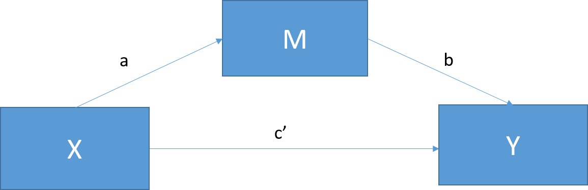

```{r, setup, include=FALSE,echo = FALSE}
knitr::opts_chunk$set(collapse = TRUE, comment = ">", 
                      fig.retina = 3, warning = FALSE, message = FALSE)
library(RefManageR)
library(AER)
library(stargazer)
library(sjPlot)
library(sjmisc)
library(sjlabelled)
library(mediation) #Mediation package
library(rockchalk) #Graphing simple slopes; moderation
library(multilevel) #Sobel Test
library(bda) #Another Sobel Test option
library(gvlma)
BibOptions(check.entries = FALSE, bib.style = "authoryear", style = "markdown", dashed = TRUE)
bib <- ReadBib("bib1.bib")
css.fig <- list(
    css.depvarhead = 'color: red;',
    css.centeralign = 'text-align: left;', 
    css.firsttablecol = 'font-weight: bold;', 
    css.summary = 'color: blue;'
  )
```
# 什么是中介效应和调节效应？

- 无论中介效应还是调节效应都并非单纯的分析方法，它们更多是变量（概念）间关系的描述。

- 中介作用研究X对Y的影响时，是否先通过某个中介变量M再去影响Y。比如工作满意度X会影响工作绩效Y，但是这个影响可能是通过创新氛围M产生关系。

- 中介效应模型可以分析自变量对因变量影响的过程和作用机制，因此常用于心理学研究。在经济学中也常用于政策作用机制的检验。

- 调节作用是指研究X对Y的影响时，是否收到某个变量Z的干扰。比如行车速度X会对发生车祸的可能性Y产生影响，但这种影响关系会收到是否喝酒Z的干扰。及Z的取值对于X和Y的关系强度有影响。

- 下面模拟一组数据和变量关系。
```{r}
set.seed(123) 
N <- 100 
X <- rnorm(N, 175, 7) #IV; hours since dawn
M <- 0.7*X + rnorm(N, 0, 5) #Suspected mediator; coffee consumption 
Y <- 0.4*M + rnorm(N, 0, 5) #DV; wakefulness
Meddata <- data.frame(X, M, Y)
```

---
# 中介效应图示

Baron & Kenny (1986) 逐步回归法：


```{r echo = F, fig.align='center', fig.cap="图1 - 总效应回归"}

```


```{r echo = F, fig.align='center', fig.height=5, fig.cap="图2 - 直接和间接效应回归" }

```


---
# 总效应

```{r}
fit <- lm(Y ~ X, data=Meddata)
summary(fit)
```
$\hat{c}=$ `r coef(fit)[2]`.
---
# A 路径
```{r}
fita <- lm(M ~ X, data=Meddata)
summary(fita)
```

$\hat{a}=$ `r coef(fita)[2]`.
---
# B 路径
```{r}
fitb <- lm(Y ~ M + X, data=Meddata)
summary(fitb)
```
$\hat{b}=$ `r coef(fitb)[2]`, $\hat{c\prime}=$ `r coef(fitb)[3]`

---
# 逐步回归检验

- 总效应 = 直接效应 + 间接效应
$$c=c\prime + ab$$
1. 检验总效应c是否显著

2. 联合检验 $H_0: ab=0$。

3. 检验直接效应 $c\prime$ 是否显著，以区分完全中介还是部分中介效应。

系数乘积的检验2是中介效应检验的核心。如何检验？

- 分别检验 $a=0$ 和 $b=0$，如果都拒绝，则 $ab=0$的原假设也应该拒绝。

- 该方法的第一类错误较低，但是检验效力 (power) 较低。

- Sobel检验提出直接检验，并使用统计量 $z=\hat{a}\hat{b}/s_{ab}$。

- Bootstrap发通过重复取样最后获得 $\hat{a}\hat{b}$的经验分布，其效力高于Sobel检验。

---
# Sobel 检验
```{r}
library(multilevel)
sobel(Meddata$X, Meddata$M, Meddata$Y)
```

---
# Bootstrap 检验

```{r}
fitM <- lm(M ~ X,     data=Meddata)
fitY <- lm(Y ~ X + M, data=Meddata)
fitMed <- mediate(fitM, fitY, treat="X", mediator="M")
summary(fitMed)
```

---
# 效应置信区间图
```{r fig.align='center', fig.height=7}
plot(fitMed)
```

---
# Bootstrap
```{r}
fitMedBoot <- mediate(fitM, fitY, boot=TRUE, sims=999, treat="X", mediator="M")
summary(fitMedBoot)
```

---
```{r fig.height=7.5, fig.align='center'}
plot(fitMedBoot)
```


---
# 中介效应结果解释

- ACME：（Average Causal Mediation Effects)：间接效应 = 总效应 - 直接效应。

- ADE：（average Direct Effect) 直接效应

- Total Effects: 总效应 = 直接效应 + 中介效应

- 另外一个重要的问题是：要不要检验总效应？一般认为应该检验c是否显著，如果c不显著，则所研究的问题可能完全是另外一个故事。

- 是否有必要区分完全中介和部分中介？

- 一般，当总效应较小且样本较小时，容易得到完全中介的情况。但是完全中介排除了探索其他中介的可能性。因此，有学者呼吁放弃完全中介的概念。

---
# 中介效应检验流程 （温忠麟等，2014）

- 第一步：检验c是否显著，如果显著，按照中介效应理论，否则按照遮掩效应理论。如果是否显著，均进行下一步检验。

- 第二步：依次检验a和b是否显著，如果两个都显著，则间接效应显著，转入第四步。如果至少有一个不显著，进行第三步。

- 第三步：用Bootstrap法检验 $H_0: ab=0$。如果显著，则间接效应显著，进行第四步。否则间接效应不显著，停止分析。

- 第四步：检验系数 $c\prime$ 是否显著，如果不显著，则直接效应不显著，说明只有间接效应（中介效应）。如果显著，则直接效应显著，进行最后一步。

- 第五步：比较 ab 和 $c\prime$ 的符号，如果同号，则属于部分中介效应，报告中介效应占总效应的比例 $ab/c$。如果异号，属于遮掩效应，报告间接效应与直接效应比例的绝对值 $|ab/c\prime|$。

---
# `mediation`包
- R中的`mediation`包提供了进行中介效应分析的完整工具包。
```{r}
library(mediation)
data("framing")
head(framing, 3)
```

---
# 使用`mediation`包
```{r}
med.fit <- lm(emo ~ treat + age + educ + gender + income, data = framing)
out.fit <- glm(cong_mesg ~ emo + treat + age + educ + gender + income, data = framing, family = binomial("probit"))
med.out <- mediate(med.fit, out.fit, treat = "treat", mediator = "emo", robustSE = TRUE, sims = 100)
summary(med.out)
```
---
# 非参数bootstrap
```{r}
med.out <- mediate(med.fit, out.fit, boot = TRUE, treat = "treat", mediator = "emo", sims = 100)
summary(med.out)
```

---
# 中介效应图示
```{r}
plot(med.out)
```
---
# 处理-中介效应交互
```{r}
med.fit <- lm(emo ~ treat + age + educ + gender + income, data=framing)
out.fit <- glm(cong_mesg ~ emo * treat + age + educ + gender + income, data = framing, family = binomial("probit"))
med.out <- mediate(med.fit, out.fit, treat = "treat", mediator = "emo", robustSE = TRUE, sims = 100)
summary(med.out)
```
```{r}
test.TMint(med.out, conf.level = .95)
```

---
# 调和效应 

- 调和效应通过检验调和变量 $Z$ 和解释变量 $X$ 的交互项的显著性。

- 在检测调和效应前，最好将相关变量作中心化处理。

```{r}
set.seed(123)
N  <- 100 #Number of participants; graduate students
X  <- abs(rnorm(N, 6, 4)) #IV; Hours of sleep
X1 <- abs(rnorm(N, 60, 30)) #Adding some systematic variance for our DV
Z  <- rnorm(N, 30, 8) #Moderator; Ounces of coffee consumed
Y  <- abs((-0.8*X) * (0.2*Z) - 0.5*X - 0.4*X1 + 10 + rnorm(N, 0, 3)) #DV; Attention Paid
Moddata <- data.frame(X, X1, Z, Y)
Xc  <- c(scale(X, center=TRUE, scale=FALSE))
Zc  <- c(scale(Z,  center=TRUE, scale=FALSE))
```

```{r}
fitMod <- lm(Y ~ Xc + Zc + Xc*Zc)
coef(summary(fitMod))
```

---
# 调和效应图示
```{r fig.height=6}
library(rockchalk)
ps  <- plotSlopes(fitMod, plotx="Xc", modx="Zc", xlab = "Sleep", ylab = "Attention Paid", modxVals = "std.dev")
```


---
# 调和中介 (moderated mediation)效应

ACME的程度取决于某个处理前协变量 (pretreatment covariate)，该协变量称作moderator.
```{r}
med.fit <- lm(emo ~ treat * age + educ + gender + income, data=framing)
out.fit <- glm(cong_mesg ~ emo + treat * age + emo * age + educ + gender + income, data = framing, family = binomial("probit"))
med.age20 <- mediate(med.fit, out.fit, treat = "treat", mediator = "emo", covariates = list(age = 20), sims = 100)
med.age60 <- mediate(med.fit, out.fit, treat = "treat", mediator = "emo", covariates = list(age = 60), sims = 100)
```
.pull-left[
```{r}
summary(med.age20)
```

]
.pull-right[
```{r}
summary(med.age60)
```

]

---
# 直接估计调和中介效应
```{r}
med.init <- mediate(med.fit, out.fit, treat = "treat", mediator = "emo", sims=2)
test.modmed(med.init, covariates.1 = list(age = 20), covariates.2 = list(age = 60), sims = 100)
```

